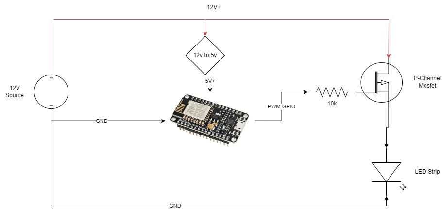
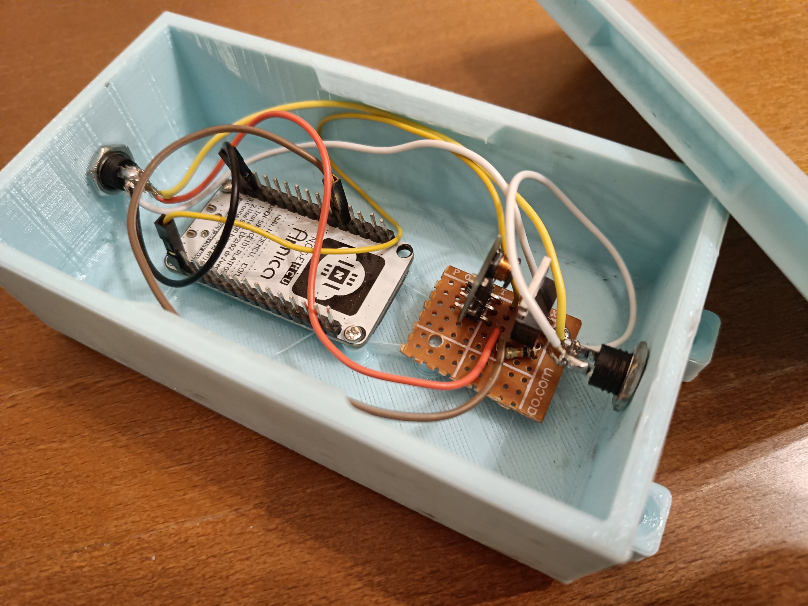
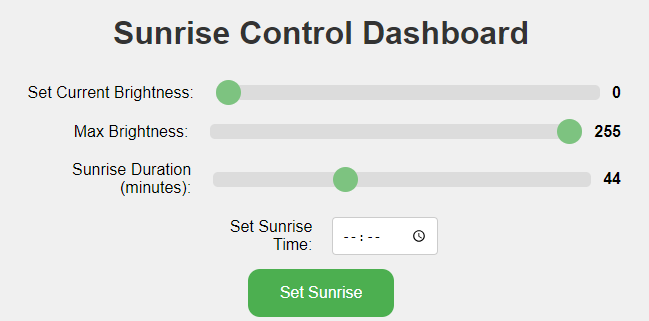
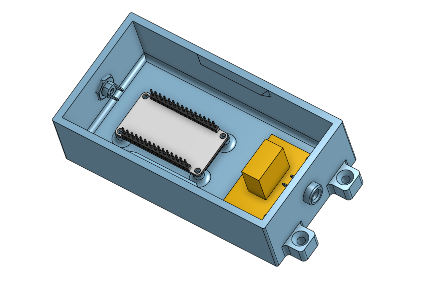

# SunriseLEDs

ESP8266 based project to slowly light a 12v LED strip or any other PWM controlled source of light to simulate sunrise light.  
Control using Telegram bot / MQTT (good for home assistant) / local network web dashboard.

## Motivation

I always appreciate waking up when the room is lit, but a big tree covers my single window and no light enters through it.  
Introducing - my own private sunrise.

Also good if you wake up after/before sunrise and want to have your own sunrise.

## System Requirements

- [X] Set a time for a target brightness and total durations
- [X] Control using local webpage
- [X] OTA updates over WiFi
- [ ] Find way to avoid soldering and 12v power supply (maybe 5V LED strip?)
- [ ] Add smart switch mode - just start a sunrise as soon as powered on
- [ ] Push button integration to turn lights completely on and off, as god intended for a light

## Prerequisites

- ESP8266 (NodeMCU preferably)
- P-Channel MOSFET
- 12v Power Supply
- 12v to 5v Converter
    - Alternatively use another 5V source with a common ground with the 12v power supply
- Soldering capabilities

## Method

### Hardware
1. ESP8266/32 (NodeMCU preferably) to connect to run the code, connect to WiFi and generate a relevant PWM signal
2. 12V LED Strip that is dimmed by the 12V PWM Signal
3. P-Channel MOSFET to "convert" the 3.3V PWM to 12V PWM

### Software
1. Get a fixed format message from various sources  - 
   1. Local webpage
   2. Telegram channel with a bot / conversation with a bot to control
   3. MQTT
2. Create a single-time alarm for a specific time to initiate the sunrise routine
3. Increment PWM duty cycle until full @ the right time
   
# Getting Started
## Building it
This is the "electrical schematics" 

I used IRF9540N P-Channel MOSFET and cut a breadboard with a box opener - 

## Installation

1. Clone the project and open a PlatformIO Workspace
   1. If you are using Arduino IDE, just copy the main.cpp and config_example.h
2. Rename config_example.h to config.h and update configuration

# Usage
In each method you basically edit these parameters
- Current brightness - ...
- Max brightness - the target brightness that the sunrise will reach
- Sunrise Duration (minutes) - how many minutes will the sunrise take - meaning the sunrise will start from [Sunrise Duration] minutes before [Sunrise Time]
- Sunrise time - when will the LEDs reach FULL brightness
  

## Web Dashboard
1. Locate your ESP IP address using router admin dashboard or other methods
2. Type it in your web browser

  

## Telegram
1. Create a bot and get your token and chat id
2. Edit the configuration
### Messages format
- /settime HH:MM - to set the sunrise time and activate it
- /setduration MINUTES - to set the Sunrise Duration (minutes)
- /setbrightness BRIGHTNESS - to set the current brightness
- /setmaxbrightness - to set the target sunrise brightness
- /reboot

## MQTT
1. Configure publisher IP and topic in the config
2. Publish same messages as above

# Extras
You can 3D print a box that has:
1. Standoffs for an upside down ESP8266 NodeMCU to be mounted using self-tapping screws
2. Holes for barrel jack panel connector
3. A lid and holes for screws

Download "box_and_lid.stl", slice it and go ahead